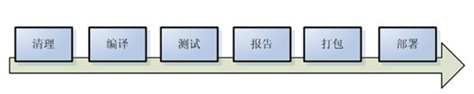
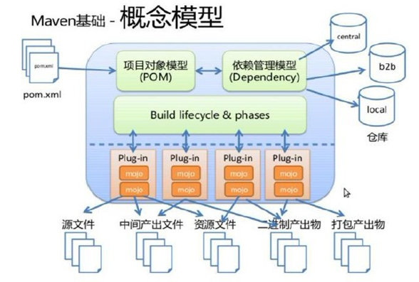

# maven

## 1. 概述

首先我们知道一个项目的构建流程是



Maven是一个项目管理工具（Java），也可以理解为一个项目的构建工具，它包含

* 项目对象模型（Project Object Model,POM）
* 一个标准集合
* 一个项目生命周期的管理
* 项目依赖管理系统
* 插件机制（自定义构建流程）



### 1.1 Maven的基本概念

掌握Maven，要了解的概念：

* POM配置文件文件，作为Maven的核心，它以xml文件的形式表述项目的资源，例如源码、测试代码、依赖等等。

* 构建生命周期、阶段和目标。一个构建周期由一系列的构建阶段组成，每一个构建阶段由一系列目标组成。

* 依赖和仓库。Maven会根据POM配置文件，检测项目的依赖，并且自动加载依赖。加载的方式是优先在本地仓库加载，如果没有，在通过网络方式从中央仓库加载。

* 插件。插件提供了构建过程中的灵活性，可以通过插件来自定义我们的构建过程，满足项目的需求。

## 1.2  Maven的项目结构

在Maven中，创建项目的结构有一定的约定：

```
-src
    - main
        -java : 存储项目的java文件
        -resources : 存放项目的资源文件
    -test
        -java : 存放所有测试的java文件
        -resources ： 存储测试用的资源文件
- target : 项目输出位置
- pom.xml 文件
```

## 2. 入门

### 2.1 安装

[下载](http://maven.apache.org/download.cgi)

下载之后解压，配置环境变量即可

```
// linux，在用户目录下 ～/.bashrc 添加
export M2_HOME=解压之后放置的目录
export PATH=$M2_HOME\bin:$PATH

// window在环境变量中，新建环境变量
M2_HOME=解压之后放置的目录
// 在path后面添加
;%M2_HOME%/bin;
```

### 2.2 手动创建地一个Maven项目

我们可以通过`generate(生成器)`，来快速构建一个maven项目。

```shell
mvn archetype:generate
```

*第一次运行时，mvn会从网络下载一些插件到本地仓库，需要等待一段时间*

## 其他

1. [maven命令速查表](./instructions.md)
2. [pom文件语法解析](./pom.md)

## 参考资料

1. http://www.cnblogs.com/yangang2013/p/5651906.html
2. http://ifeve.com/maven-1/